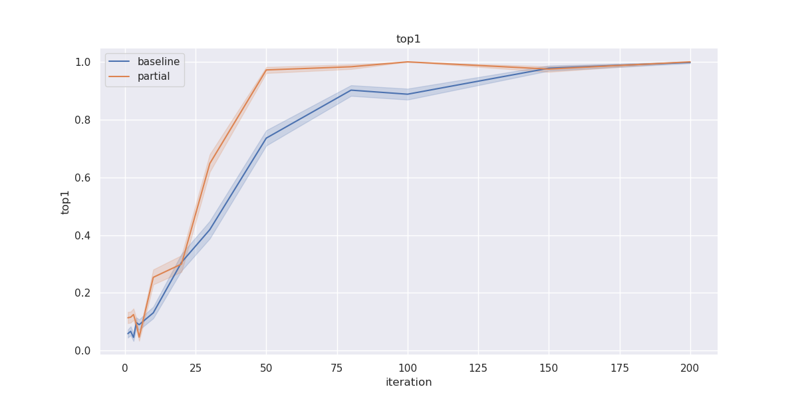
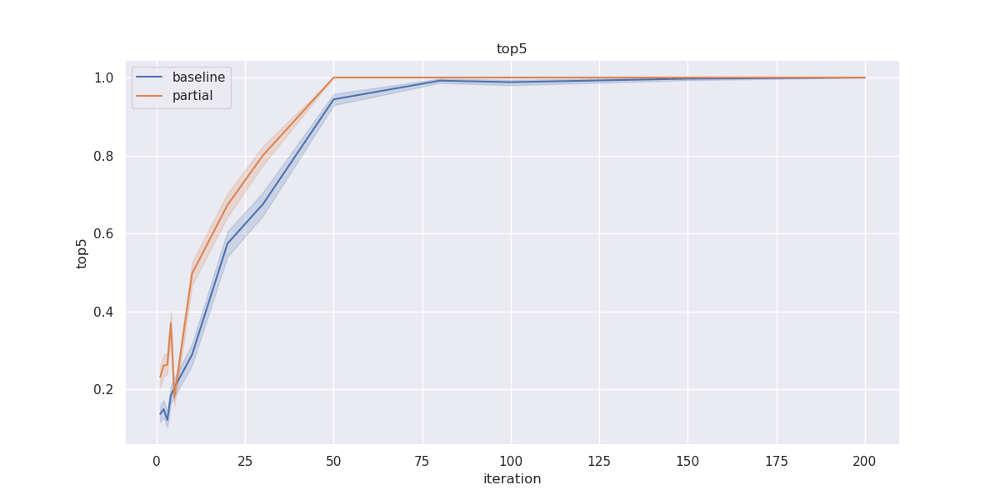
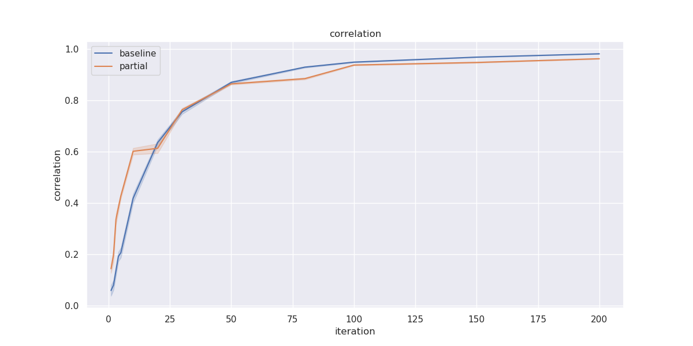

# Human Friendly Preference Modeling
## Table of Contenets
* [Human Friendly Preference Modeling](#human-friendly-preference-modeling)
    * [Quick start](#quick-start)
        * [Simulation](#simulation)
        * [Visualization](#visualization)
        * [Examples (Random Experiments)](#examples-random-experiments)
    * [Project implementation structure](#project-implementation-structure)
    * [Useful links](#useful-links)

## Quick start
### Simulation 
```
# Simulation with random dataset and a linear utility function
python main.py simulate --iteration 1000 --M [1,2,5,10,20,50,100,150,200] --B 20
# Result is saved to outputs/
```
### Visualization
```
python main.py plot
```

### Examples (Random Experiments)





## Project implementation structure 
```
|-data      # Dataset 
|-exp       # Experiment structure
|-eval      # Evaluation logic
|-stan      # Stan models
|-outputs   # Experment outputs
|-main.py   # Entry point
```

## Useful links 
- [Stan User's Guide](https://mc-stan.org/docs/2_22/stan-users-guide/index.html)
- [PyStan API](https://pystan.readthedocs.io/en/latest/api.html)


--- 
Maintainers: [@Hao](mailto:haosheng@cs.stanford.edu)
